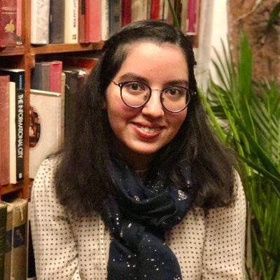

[Email](mailto:houda.physics@gmail.com) / [LinkedIn](https://www.linkedin.com/in/houdahaidar/) / [Twitter](https://twitter.com/blackholephd)

  <!-- Image part -->
  

    
  

  
  <!-- Text part on the right side of the image -->
  

   
  Hi there! I am a PhD student at Newcastle University studying supermassive black holes! Previously, I've completed my Masters at Observatoire de Paris in France and my Bachelors at Queen Mary University of London. 

 My research interests lie within the field of galaxy formation and evolution. More specifically, I am interested in understanding how supermassive black holes form, grow, and evolve in symbiosis   with their host galaxies. My PhD project focuses on understanding the interplay between AGN and their host galaxy using novel data from the James Webb Space telescope (JWST). 

Born and raised in Morocco, becoming an astrophysicist was a dream and challenge I was committed to against all odds. Today, as an astrophysicist, I hope to help under-represented people to pursue an education in STEM. In my free time, I enjoy creating digital arts and cooking delicious vegan meals.

